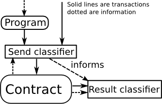

Idea is to classify the effects of an action. That may be wether or not the
effects warrant human intervention, require note in a log, or generally the
'severity' of the effect, or it may be a bug.

The classifiers can be placed as such:

The input could be random data, and the whole thing 'mere' simulation for the
purpose of testing. Everything could be a simulation so the user knows which
classifiers where triggered.

The send classifier, program pair is already a test, of just the program.

Result the classifier tests the contract, some of the statements tested here
only tell something about the contract if the input didnt fail already.

So how do we classify, in a way that is very clear? Firstly, the classifiers
should have different levels of specificness, because if you go too specific,
you essentially reimplement the contract. Also, this allows people trying to
assess the `C` to start at the simpler promises of the classifiers. Also it
should clarify the logic.

## The approach

The approach is to have statements that gather data into variables. Firstly,
the transaction and contract information. Then in the second stage, 
transactions information from the contract, and post-run contract info.
The second stage is not allowed to change state, all calculations using
state have to be done beforehand, this is to force clarity in the claims.

This information is put together into boolean logic statements, each with a
name, which classify, by the statements being true/false.

Under each name, a new set of potential classifications are possible, and
the process is repeated.

## Escrow Example to illustrate: 

We take the [escrow](https://github.com/jorisbontje/cll-sim/blob/master/examples/escrow.cll)
example from Joris Bontjes' [cll-sim](https://github.com/jorisbontje/cll-sim/blob/master/examples/escrow.cll)). This is pre-serpent, and cll-sim hasnt been updated
to serpent. Yet, but the purpse here is to illustrate, not to provide
a tutorial or example code.

For good measure/convenience, here is the code of the contract:

    if tx.value < 100 * block.basefee:
        stop
    
    state = contract.storage[1000]
    if state == 0 and tx.value >= PRICE:
        contract.storage[1000] = 1
        contract.storage[1001] = tx.sender
        contract.storage[1002] = tx.value
        contract.storage[1003] = block.timestamp
    else if state == 1:
        if tx.sender == VERIFIER:
            mktx(MERCHANT, contract.storage[1002], 0, 0)
            contract.storage[1000] = 2
        else if block.timestamp > 30 * 86400 + contract.storage[1003]:
            mktx(contract.storage[1001], contract.storage[1002], 0, 0)
            contract.storage[1000] = 3

The idea is that a sender pays to the contract, if the verifier confirms
the service/good was provided by the merchant, he tells the contract to 
pass it along to the merchant. If he doesnt verify, there is a timeout,
after which anyone can trigger the contract to return the ethers to the
payer.

### Send classifier
We will write down the test in code essentially. However, the intention for 
execution is that `bug` and `note` infact just log the information, not
terminating.

    send_vars:  # allowed to access (tx, promise, contract)
        fee = 100*block.basefee
        pre_state = contract.storage[1000]
        
    send_classify:
        if tx.value < fee:  # (Obsolete due to gas, of course!)
            bug("Not enough for fee")
            
        if tx.value > fee and not promise.what == PAYING:
            bug(In excess of fee")
        
        if promise.to_address != contract.address:
            bug("Sending to wrong address")

        if promise.to_name != contract_name(contract.address):
            bug("Name suddenly changed?!")

        if promise.what == PAYING:
            if pre_state != 1: 
                bug("Contract not in buying stage")
            
            if contract.PRICE != promise.price:
                bug("Disagreement on price")
            
            if tx.value > contract.PRICE:
                bug("Paying more than you need too")
            if tx.value < contract.PRICE:
                bug("Not paying enough")
            
            if not own(tx.sender):  # Refunds would end up in wrong place.
                bug("Dont own that address")

        elif promise.what == VERIFYING:
            if tx.sender != contract.VERIFIER:
                bug("Only verifier can verify!")
                if own(contract.VERIFIER):
                    note("You do own the verifier address, you couldnt do this being used")

        elif promise.what == REFUND:  # Poking for refund.
            if pre_state != 1:
                bug("It is not in the verifying/refund pre_state!")

            if pre_state == 1 and block.timestamp <= 30 * 86400 + contract.storage[1003]:
                bug("Its too early for a refund")

If you look at the code, note that you could follow any branch of logic
separately, they're not interconnected. Which is fortunate, because this
check for transactions going into the contract is longer than the contract
itself.

It should not be seen as python code, but as pseudocode representing the
below graph:

**TODO GRAPH** (probably use `dot` to generate)

So the code could really be general Ethereum code, but with a tree that uses
the variables at the end, so the claims are clearer.

Quite a few of the clauses could imply lost money if violated. The contract
doesnt support getting more out than was intended to be paid. Essentially 
this means ether can only be stolen by messing up `tx.to_address`
(a wrong `tx.sender` cant actually be done because you cant sign
transactions coming from senders whoms' privkeys you do not have)

`tx.to_address` is maybe one of the hardest to check, as the program can fake
its promise aswel as the address the transaction sends too, and you cannot tell
the users intention. Some solutions:

1. Use naming system like NameReg, and `contract_name(address)` returns the name.
   This can be checked with `promise.to_name`. Prominently show the name.

2. Maybe use some sort of promise on what the contract looks like.

#### Result classifier

    result_vars:
        post_state = contract.storage[1000]
        
    result_classifier[0]:  # (contract, tx=tx[0], send)
        if promise.post_state != post_state:
            bug("Post state not as promised!")

**TODO graph**

## Fuzz testing corner cases

One thing about fuzz testing is that it can be hard to find realistic
test cases, that find corner cases.

To improve this you can try tailor them. But here we have a potential 
source of them in the form of what already goes on on (test)blockchains.
